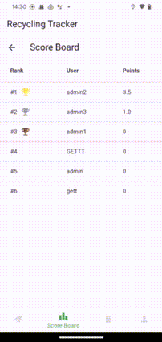

# WasteWise Recycle App

 

  

  

     
    ·
    <a href="https://github.com/youdianhaoxiao/CASA0015-RecyleApp">Code</a>
    ·
  

  
Table of Contents

  <ol>
    <li>
      Overview
      <ul>
        <li>Highlight</li>
        <li>Dependencies</li>
      </ul>
    </li>
    <li>Installation</li>
    <li>License</li>
    <li>Contact Details</li>
  </ol>

## Overview

WasteWise is dedicated to helping users efficiently and conveniently sort and track recyclable waste, improving recycling efficiency and promoting higher recycling rates among residents, all while contributing to the protection of the environment.

  

Main Interfaces：
* Login Screen
* Sign Up Screen
* Record Tracker
* Score Board
* Map with markers
* Account Profile

### Feature Highlights
* Users sign up and Log in: Users can register for an app account by providing an email address and setting a password. Once registered, they can log in using their email and password to access and enjoy the app's features.

  

* **Waste Classification Record**: Once users successfully log in, they are presented with eight different waste categories on the interface. By clicking on any category card, users can view textual explanations for that category along with a slider. Users can accurately identify the type of waste they need to recycle and record the weight of the recyclable waste by adjusting the slider.

  

* **Ranking Score Board**: Users can navigate to the Scoreboard page by clicking on the navigation bar located at the bottom of the screen. This page displays the top ten users based on the total weight of recycled waste they have stored.

  

* **Real-time Route Planning**:The Map interface displays the addresses of all current recycling stations in London (download from [overpass](https://overpass-turbo.eu/index.html)), marked in red. The user's real-time location is shown with a blue marker (if the user has granted the app permission to access their location). By clicking on a red marker, the page will display the route from the user's location to that destination. Users can switch between different modes of transportation for route navigation using the buttons at the bottom of the screen.

  

* **Account Information**: The Profile interface displays the user's information, including email address, user name and the weight of recycled waste recorded under each category. Users can also log out through this interface.

  

### Dependencies

* [firebase_core](https://pub.dev/packages/firebase_core): Responsible for connecting and initializing your Flutter app with your Firebase project.
* [firebase_auth](https://pub.dev/packages/firebase_auth): Integrate Firebase Authentication into Flutter app to supports various authentication methods.
* [google_maps_flutter](https://pub.dev/packages/google_maps_flutter): Used for embedding interactive and customizable maps provided by Google Maps services within your app.
* [location](https://pub.dev/packages/location): Used for getting the current location of the device by access the device's GPS sensor to fetch latitude and longitude.
* [geojson](https://pub.dev/packages/geojson): Used to parse and generate GeoJSON data, a format for encoding geographic data structures. 
* [flutter_polyline_points](https://pub.dev/packages/flutter_polyline_points): Utilized for fetching polyline points from the Google Maps Directions API to draw routes between two geographical locations on a map.
* [cloud_firestore](https://pub.dev/packages/cloud_firestore): Integrates the Cloud Firestore service into Flutter app to store and sync data between users and devices in real-time with offline support.
* [google_maps_routes](https://pub.dev/packages/google_maps_routes): Helps with generating and displaying routes using the Google Maps API.

## Installation

Get started with WasteWise and enhance your recycling efforts today.

**For Android Users**: 

WasteWise is just a tap away. Visit our [GitHub Releases page](https://github.com/youdianhaoxiao/CASA0015-RecyleApp/releases/tag/v1.2.43) to find the most recent version of the app. Download the `.apk` file and follow the standard installation procedure for Android applications to get start with WasteWise.

**For iOS Users**: 

We are dedicated to delivering a remarkable WasteWise experience for you. The iOS version is currently under development, and we are diligently working to bring it to your Apple devices. Stay tuned for further updates and release news!

Be sure to check our releases regularly for new updates, enhancements, and features as we continually evolve WasteWise to better serve you.

## License

MIT License

Copyright (c) Ertong Gao

Permission is hereby granted, free of charge, to any person obtaining a copy of this software and associated documentation files (the "Software"), to deal in the Software without restriction, including without limitation the rights to use, copy, modify, merge, publish, distribute, sublicense, and/or sell copies of the Software, and to permit persons to whom the Software is furnished to do so, subject to the following conditions:

The above copyright notice and this permission notice shall be included in all copies or substantial portions of the Software.

THE SOFTWARE IS PROVIDED "AS IS", WITHOUT WARRANTY OF ANY KIND, EXPRESS OR IMPLIED, INCLUDING BUT NOT LIMITED TO THE WARRANTIES OF MERCHANTABILITY, FITNESS FOR A PARTICULAR PURPOSE AND NONINFRINGEMENT. IN NO EVENT SHALL THE AUTHORS OR COPYRIGHT HOLDERS BE LIABLE FOR ANY CLAIM, DAMAGES OR OTHER LIABILITY, WHETHER IN AN ACTION OF CONTRACT, TORT OR OTHERWISE, ARISING FROM, OUT OF OR IN CONNECTION WITH THE SOFTWARE OR THE USE OR OTHER DEALINGS IN THE SOFTWARE.

## Contact Details

If you have any questions about the project or any innovative ideas you'd like to discuss, please don't hesitate to contact me via [Email](mailto:ucfnega@ucl.ac.uk). 

Your feedback and suggestions are invaluable as we strive to improve and expand our project.

